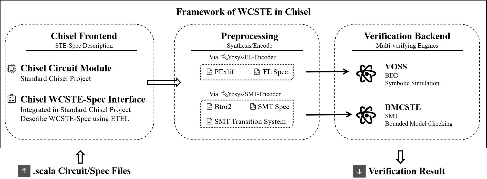
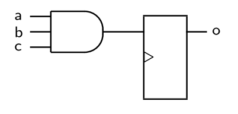
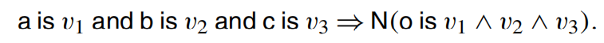
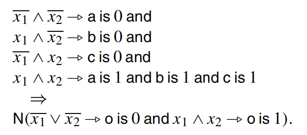
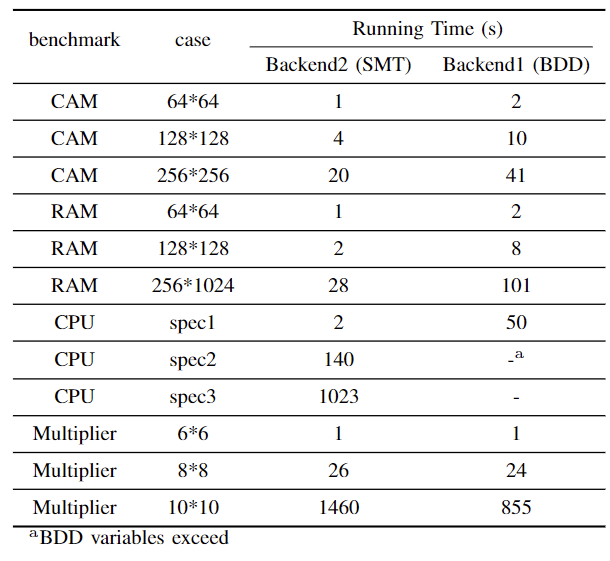

# WCSTE

# Introduction

This a **STE model checker** for formal verification of **Chisel**, with multi-verifying engines.  The tool emulates Chisel's native test module and seamlessly integrates STE into the Chisel project. It enhances agile development and verification in the chisel ecosystem. Besides, we offer users the freedom to choose the verification backend engine. Apart from the BDD-based STE, we introduce a novel STE algorithm combined with SMT and bound model checking.

## Verification Workflow



### Process1 - Chisel Frontend

The Chisel frontend module comprises two components: the Chisel circuit design and the Chisel STE Specification interface. The STE Specification interface serves as a tool for circuit designers to articulate circuit specifications utilizing an extended trajectory evaluation logic.

1.  To enhance user convenience, we have seamlessly incorporated the STE Specification interface into the Chisel project. 
2. Additionally, we expanded the verification module by leveraging Chisel's native test module and employed the extended trajectory evaluation logic to formulate circuit specifications for the verification process.

### Process2 - Preprocessing

The preprocessing module serves as a crucial intermediary between the frontend and backend, primarily tasked with circuit synthesis and coding. It undertakes the preparation of circuits and specifications in intermediate formats tailored to the different engines of the verification backend. 

1. In the case of traditional Symbolic Trajectory Evaluation engines, we employ Yosys to transform Chisel circuits into PExlif circuit netlists. Simultaneously, the STE specifications outlined by the frontend are encoded into the corresponding FL Functional Language format. 
2. In the context of the BMCSTE engine discussed in this article, the Chisel circuit undergoes conversion into a Btor2 circuit netlist. Subsequently, it is transformed into an SMT-encoded transition system. The STE specifications described in the frontend are also subject to SMT encoding.

### Process3 - Verification Backend

The verification backend module is dedicated to STE verification, employing two distinct approaches. 

1. The first utilizes the traditional VossII tool, employing a BDD-based symbolic simulation algorithm for STE calculations, which is a great STE tool for Verilog using FL language.
2.  The second introduces the BMCSTE algorithm, a novel STE approach combining Satisfiability Modulo Theories and Bounded Model Checking. The algorithm is built on pono, which is a great model checker; and the SMT solver used is boolector.
3. In the contemporary realm of model checking, flexibility in choosing engines and algorithms holds significance. Consequently, this article offers users a selection of multi-verifying engines.

## Install

#### Install Chisel 

This is an STE model checker for Chisel, please make sure you have the correct Chisel environment.

If you don't have, follow the instruction in https://github.com/chipsalliance/chisel-template.

* JDK 8 or newer

We recommend LTS releases Java 8 and Java 11. You can install the JDK as your operating system recommends, or use the prebuilt binaries from [AdoptOpenJDK](https://adoptopenjdk.net/).

* SBT or mill

SBT is the most common build tool in the Scala community. You can download it [here](https://www.scala-sbt.org/download.html).
mill is another Scala/Java build tool without obscure DSL like SBT. You can download it [here](https://github.com/com-lihaoyi/mill/releases)

#### Install pono 

follow the instruction in https://github.com/stanford-centaur/pono

```
cd {WCSTE_dir}/external/pono
./contrib/setup-bison.sh
./contrib/setup-flex.sh
./contrib/setup-smt-switch.sh
./contrib/setup-btor2tools.sh
./configure.sh
cd build && make
```

#### Install VossII

follow the instruction in https://github.com/TeamVoss/VossII

```scala
export PATH={WCSTE_dir}/external/voss/bin$PATH
```

#### Run an example and Test whether the installation is successful

```scala
sbt "testOnly test.testSpec"
```

## Install (option)

If you don’t want to go through the trivial installation and configuration work，we provide a complete linux environment (Docker). 

```
// load the docker image
docker load -i wcste-u.tar

// go into the docker and you can directly use WCSTE
cd /WCSTE

// e.g. run an ram example
sbt "testOnly ram.ramSpec"
```


## How to Verify a Chisel Circuit 

### WCSTE Spec

Users do not need to pay attention to how the backend is verified, but users need to understand what a complete STE specification is.

A complete STE specification can be viewed as **A(ntecedent)=>C(onsequce)**. It means that under the specified premise constraints (A), the specified expected results (C) can be obtained

How to define A and C specifically depends on the grammar we prescribed, which is called ETEL. 


For specific syntax, please refer to src/scala/ste.

### A Motivated Case

This is an example explained in [Handbook of Model Checking](https://link.springer.com/book/10.1007/978-3-319-10575-8). The circuit is a three-input, unit-delay, AND-gate.



 A direct STE verification can be the trajectory assertion of a direct simulation:



However, We can be more clever than this by using STE abstraction lattice to reduce the number of Boolean variables needed to verify this gate. The key observation is that if any one input is 0, then the output will be 0 regardless of the other inputs. There are four cases to check—three in which one of the inputs is known to be 0 and the others are unknown, and one in which all three inputs are known to be 1. We can enumerate or ‘index’ these with two Boolean variables, say *x*1 and *x*2. We write the following

property:



**Then, we can use WCSTE to try this example.**

A simple Chisel circuit Ander: the output out is the a&b&c before one cycle. 

```scala
class Ander extends Module {
  val io= IO(new Bundle {
    val a = Input(Bool())
    val b = Input(Bool())
    val c = Input(Bool())
    val out =Output(Bool())
  })
  val o =RegNext(io.a&&io.b&&io.c)
  io.out:=o;
}
```

Use the STE-Spec to verify the hardware above. You can use the tool  for STE verification just like Chisel's peekpokeTest. The code is as follows:

1. build the test project as ChiselTest do
2. import STE package
3. build the A(ntecedent) and C(onsequce) using ETEL in STE package
4. choose the SMT/BDD engine to verify

```scala
import SymbolicTrajectoryEvaluation._
//import Chisel test Package

class ander2SPec extends AnyFreeSpec with ChiselScalatestTester {
  /** STE assert ant: clock 0 : !x1!x2->!a /\ x1!x2->!b /\ !x1x2->!c /\ x1x2->a
    * /\ x1x2->b /\ x1x2->c \=========> cons clock 1: !x1|!x2 -> !o /\ x1x2 -> o
    */
  ("ander ste assert pass use SMT") in {
    test(new Ander()) { dut =>
      val x1 = VAR("x1")
      val x2 = VAR("x2")
      val ant = new  at_cycle(
        Imply((!x1) & (!x2), is(dut.io.a, false)) &&
          Imply(x1 & (!x2), is(dut.io.b, false)) &&
          Imply((!x1) & x2, is(dut.io.c, false)) &&
          Imply(x1 & x2, is(dut.io.a, true)) &&
          Imply(x1 & x2, is(dut.io.b, true)) &&
          Imply(x1 & x2, is(dut.io.c, true)),
        0
      )
      val cons = new at_cycle(
        Imply((!x1) | (!x2), is(dut.io.o, false)) &&
          Imply(x1 & x2, is(dut.io.o, true)),
        1
      )
      println(ant.eval1())
      val assert = new Assert(ant, cons,() => new Ander(), SMT)
      assert.STE
    }
  }
}
```

## Files 

After step running the program, some files are generated under the path ./{Chisel Module Name}_build/ .

### 1. {Chisel Module Name}.sv/v

The SystemVerilog/Verilog generated by ChiselStage().emitSystemVerilog().

### 2. verify.fl (engine1 BDD-Based)

The fl is an functional language parsed from WCSTE Specification needed by Voss.

### 3. {Chisel Module Name}.btor2 (engine2 SMT-Based)

The transition system needed by SMT solver, which is generated by Yosys.

### 4. counterExample.vcd

If the specification holds, it will return true. However, if the specification does not hold, it will return a vcd of the trace of counterExample.


## Benchmark and Experimental Result in Paper

We conducted experiments using the two verification backends. As our evaluation target, we choose four Chisel circuits as the benchmark: (1) CAM/RAM; (2) a five-stage pipeline CPU designed in the classic architecture textbook; (3) a booth multiplier.



## More Details and Examples of How to Use WCSTE-Spec

In addition to the above four examples, we have given many examples to introduce how WCSTE-Spec is used. All examples can be found in src/test/examples.

For example, there is an case of FIFO that describes how to define specifications for a large number of bundles in a circuit.

```scala
val w = 16
val k = 4
test(new BubbleFifo(UInt(w.W), k)) { dut =>
  //bundle fresh variables
  val bundle_io_var_push_data = Bundle_VAR(
    new FifoIO(UInt(w.W)),
    """{
    "enq": {
      "valid": true,
      "bits" : "d[15:0]"
    },
    "deq": {
      "ready" : false
    }
  }"""
  )
  val bundle_io_var_data_received = Bundle_VAR(
    new FifoIO(UInt(w.W)),
    """{
    "deq": {
      "valid" : true,
      "bits" : "d[15:0]"
    }
  }"""
  )
  val d = VAR("d", w)
  val ant =
    at_cycle(rst(true),0) &&
      at_cycle(rst(false) && is_bundle(dut.io, bundle_io_var_push_data)
         ,1) &&
      at_cycle(rst(false),2) &&at_cycle(rst(false), 3) &&at_cycle(rst(false), 4) &&at_cycle(rst(false), 5)

  val cons =
    at_cycle(is_bundle(dut.io, bundle_io_var_data_received),
      5
    )
  val assert = new Assert(ant, cons, () => new BubbleFifo(UInt(w.W), k), BDD)
  assert.STE
```

